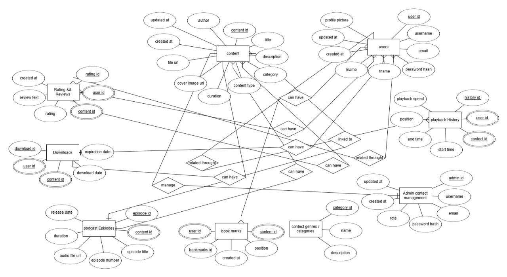
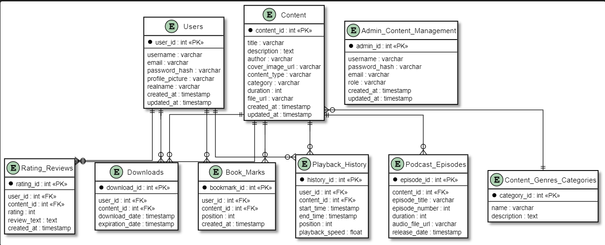

# BookMark Database Documentation

## Overview
This document describes the database structure for the BookMark application, a content management system designed for managing books, podcasts, and other media content.

## Entity Descriptions

### Users
Primary table for user management and authentication.
- **user_id** (PK): Unique identifier for each user
- **username**: User's chosen display name
- **email**: User's email address
- **password_hash**: Encrypted password
- **profile_picture**: URL to user's profile image
- **realname**: User's real name
- **created_at**: Account creation timestamp
- **updated_at**: Last profile update timestamp

### Content
Central table for all content types (books, podcasts, etc.).
- **content_id** (PK): Unique identifier for content
- **title**: Content title
- **description**: Detailed content description
- **author**: Content creator
- **cover_image_url**: URL to content cover image
- **content_type**: Type of content (book/podcast/etc.)
- **category**: Content category
- **duration**: Length/duration of content
- **file_url**: URL to content file
- **created_at**: Content creation timestamp
- **updated_at**: Content update timestamp

### Rating_&_Reviews
Stores user ratings and reviews for content.
- **rating_id** (PK): Unique identifier for rating
- **user_id** (FK): Reference to user
- **content_id** (FK): Reference to content
- **rating**: Numerical rating value
- **review_text**: Written review
- **created_at**: Review timestamp

### Downloads
Tracks user content downloads.
- **download_id** (PK): Unique identifier for download
- **user_id** (FK): Reference to user
- **content_id** (FK): Reference to content
- **download_date**: Download timestamp
- **expiration_date**: Download access expiration

### Podcast_Episodes
Manages individual podcast episodes.
- **episode_id** (PK): Unique identifier for episode
- **content_id** (FK): Reference to main content
- **episode_title**: Episode title
- **episode_number**: Episode sequence number
- **duration**: Episode length in minutes
- **audio_file_url**: URL to audio file
- **release_date**: Episode release timestamp

### Book_Marks
Tracks user bookmarks in content.
- **bookmark_id** (PK): Unique identifier for bookmark
- **user_id** (FK): Reference to user
- **content_id** (FK): Reference to content
- **position**: Position in content
- **created_at**: Bookmark creation timestamp

### Playback_History
Records user content consumption history.
- **history_id** (PK): Unique identifier for history entry
- **user_id** (FK): Reference to user
- **content_id** (FK): Reference to content
- **start_time**: Session start timestamp
- **end_time**: Session end timestamp
- **position**: Last position in content
- **playback_speed**: User's playback speed setting

### Content_Genres_Categories
Manages content categorization.
- **category_id** (PK): Unique identifier for category
- **name**: Category name
- **description**: Category description

### Admin_Content_Management
Manages administrative users and permissions.
- **admin_id** (PK): Unique identifier for admin
- **username**: Admin username
- **password_hash**: Encrypted password
- **email**: Admin email
- **role**: Administrative role
- **created_at**: Account creation timestamp
- **updated_at**: Account update timestamp

## Relationships

1. **Users to Content** (Many-to-Many):
   - Through Rating_&_Reviews
   - Through Downloads
   - Through Book_Marks
   - Through Playback_History

2. **Content to Podcast_Episodes** (One-to-Many):
   - One content can have multiple episodes

3. **Content to Content_Genres_Categories** (Many-to-One):
   - Content belongs to one category

## Database Photos

### ERD

### Database.puml

