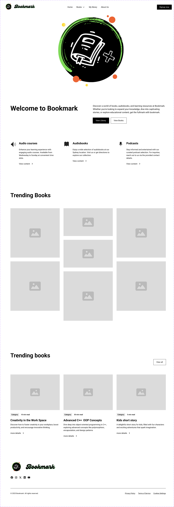
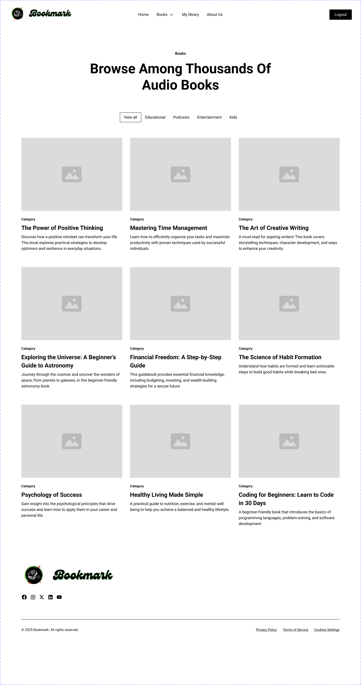
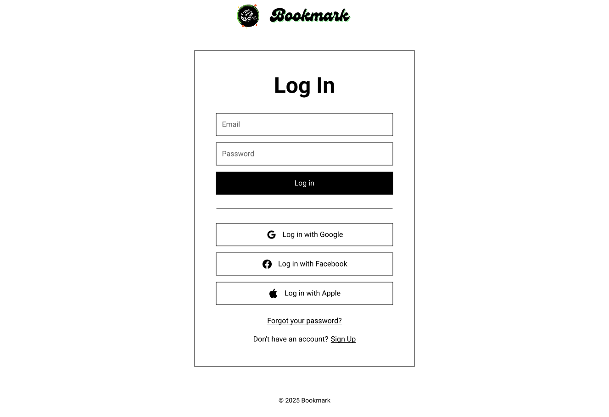
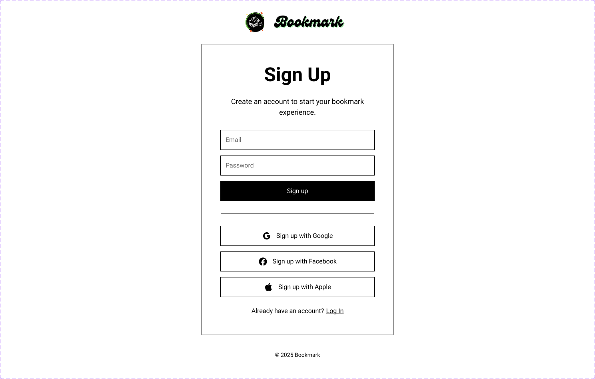

# BookMark Website Documentation

## Introduction

BookMark is a modern web application designed to help users organize and manage their reading journey. The platform allows users to track books they're currently reading, maintain a wishlist of books they want to read, and keep a record of completed books. With features like progress tracking, notes, and reading statistics, BookMark makes the reading experience more engaging and organized.

## Wireframe Documentation

### 1. Landing Page
- **Purpose**: Welcomes users and provides an overview of the application
- **Key Features**:
  - Navigation bar with login/signup options
  - Hero section with engaging visuals
  - Features showcase
  - Call-to-action buttons

### 2. User Dashboard
- **Purpose**: Central hub for user's reading activity
- **Key Features**:
  - Reading progress overview
  - Currently reading section
  - Recent activity
  - Quick access to book collections
  - Reading statistics

### 3. Book Collection
- **Purpose**: Manages different book lists
- **Key Features**:
  - Currently Reading shelf
  - Want to Read shelf
  - Completed Books shelf
  - Filter and sort options
  - Book cards with cover images and basic info

### 4. Book Details
- **Purpose**: Displays comprehensive information about a specific book
- **Key Features**:
  - Book cover and metadata
  - Reading progress tracker
  - Notes section
  - Reading status toggle
  - Rating and review system

### 5. Profile Page
- **Purpose**: User's personal space and settings
- **Key Features**:
  - Reading statistics and achievements
  - Profile information
  - Reading preferences
  - Account settings

## Wireframe Photos

### Home Page

### Books Collection

### Login Page

### Signup Page

## Figma Design

You can view the detailed design on Figma using the following link:

[Figma Design](https://www.figma.com/design/mQRPz0YTo5h6GPERSgUhEy/Bookmark?node-id=0-1&t=JxpQ87K6JPMyAnng-1)

## Design System

### Color Palette
- Primary: [Add primary color]
- Secondary: [Add secondary color]
- Accent: [Add accent color]
- Background: [Add background color]
- Text: [Add text colors]

### Typography
- Headings: [Add heading font]
- Body: [Add body font]
- UI Elements: [Add UI font]

### Components
- Buttons
- Cards
- Navigation
- Forms
- Lists
